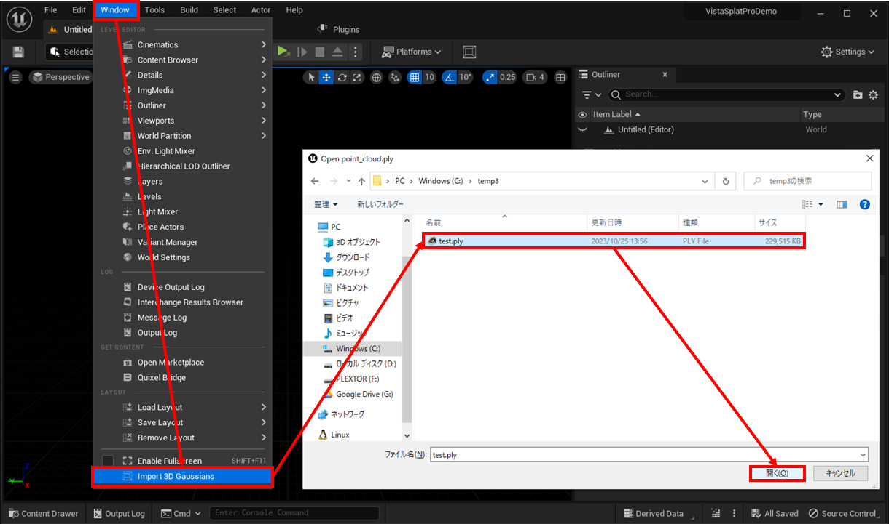
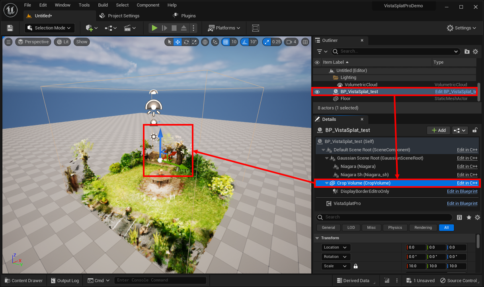

# 使い方

## インポート

{ loading=lazy }  

1. UEエディタ上部のメニューで「Window > Import 3D Gaussians」を選択します
2. ダイアログ画面で、3D Gaussian Splattingの学習結果の「point_cloud.ply」を選択します。

!!! Failure "パスは英数字のみ"
	日本語などマルチバイト文字が含まれるパスからはインポートできません。  
	パスには英数字のみが含まれるようにしてください。

## レベルへの配置

{ loading=lazy }  

コンテンツブラウザで「Content > VistaSplatPro > モデル名」の下の「BP_VistaSplatPro_モデル名」をレベル上にドラッグ＆ドロップします。

## クロップ範囲の変更

{ loading=lazy }  

1. レベルに配置した「BP_VistaSplatPro_モデル名」を選択します。
2. 詳細パネルのコンポーネントツリーで「Crop Volume」コンポーネントを選択します。
3. ビューポートまたは詳細パネルで、コンポーネントの位置、向き、サイズを変更します。

## 描画の調整

{ loading=lazy }  

- **Material Override**: 独自に修正したマテリアルを使用する場合はここにセットします。
- **Spherical Harmonics**: 色の描画方法を選択します。  
	- 「Degree 0」は見る角度による色の変化を無効にします（反射などがなくなります）。
	- 「Degree 3」は見る角度による色の変化を有効にします。
- **Cast Shadow**: 影の描画方法を選択します。  
	- 「DoNotCastShadow」にすると、このモデルから影を落とさなくなります。
	- 「CastShadow」にすると、このモデルから影を落とすようになります。
	- 「CastDetheredShadow」にすると、ディザを使用したより高品質な影を落とすようになります。  

		!!! Warning "Dethered Shadow は Virtual Shadow Map 不可"
			Virtual Shadow Mapが有効な場合、「CastDetheredShadow」にするとシャドウマップの更新が適切に行われず影が時間的に不安定になります。  
			Virtual Shadow Mapを使用する場合は、「CastShadow」に設定してください。

- **Mask Size**: 個々のガウシアンを描画するスプライトのサイズ倍率を指定します。  
	大きくするとガウス分布の端まで正しく描画されます。影を受ける範囲も広がるため、大きくしすぎると受け取った影の見た目がおかしくなります。
- **Shadow Size**: 影を落とす際の個々のガウシアンのサイズ倍率を指定します。  
	大きくするとガウス分布の端まで考慮した影を落とすようになります。Mask Sizeの半分～2/3程度がおすすめです。
- **Specular**: このモデル全体で使用するスぺキュラの値を指定します。
- **Normal**: このモデル全体で使用する世界座標系での法線の値を指定します。
