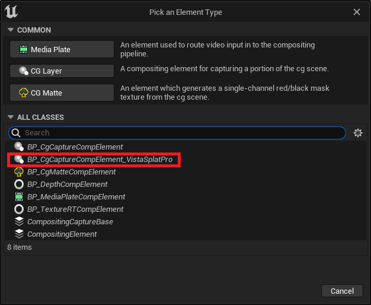
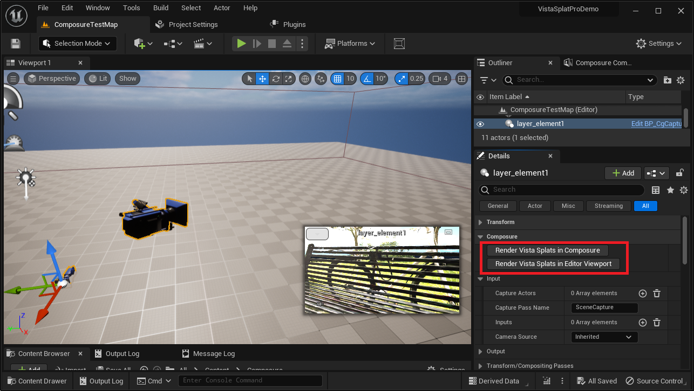

# Composureでの使い方

## CGエレメントの追加

{ loading=lazy }  

1. UEエディタのCompositing Treeでルートコンポジットエレメントを右クリックして「Add Layer Element」を選択します。
2. ダイアログ画面で、「BP_CgCaptureCompElement_VistaSplatPro」を選択します。

!!! Failure "通常のCG Layerでは正しく描画できません"
	必ず「BP_CgCaptureCompElement_VistaSplatPro」を使用してください。

## Composure向け描画の切替

{ loading=lazy }  

追加した「BP_CgCaptureCompElement_VistaSplatPro」エレメントを選択し、Detailsパネルで下記のボタンをクリックして描画方式を切り替えます。

- **Render Vista Splats in Composure**: Composureでの合成向けに描画します。  
	Composure上での描画結果は正しくなりますがエディタビューポート上では正しく描画されなくなります。
- **Render Vista Splats in Editor Viewport**: エディタビューポート向けに描画します。  
	エディタビューポート上での描画結果は正しくなりますがComposure上では正しく描画されなくなります。
